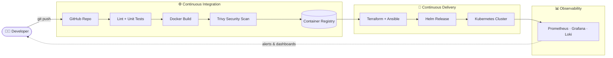
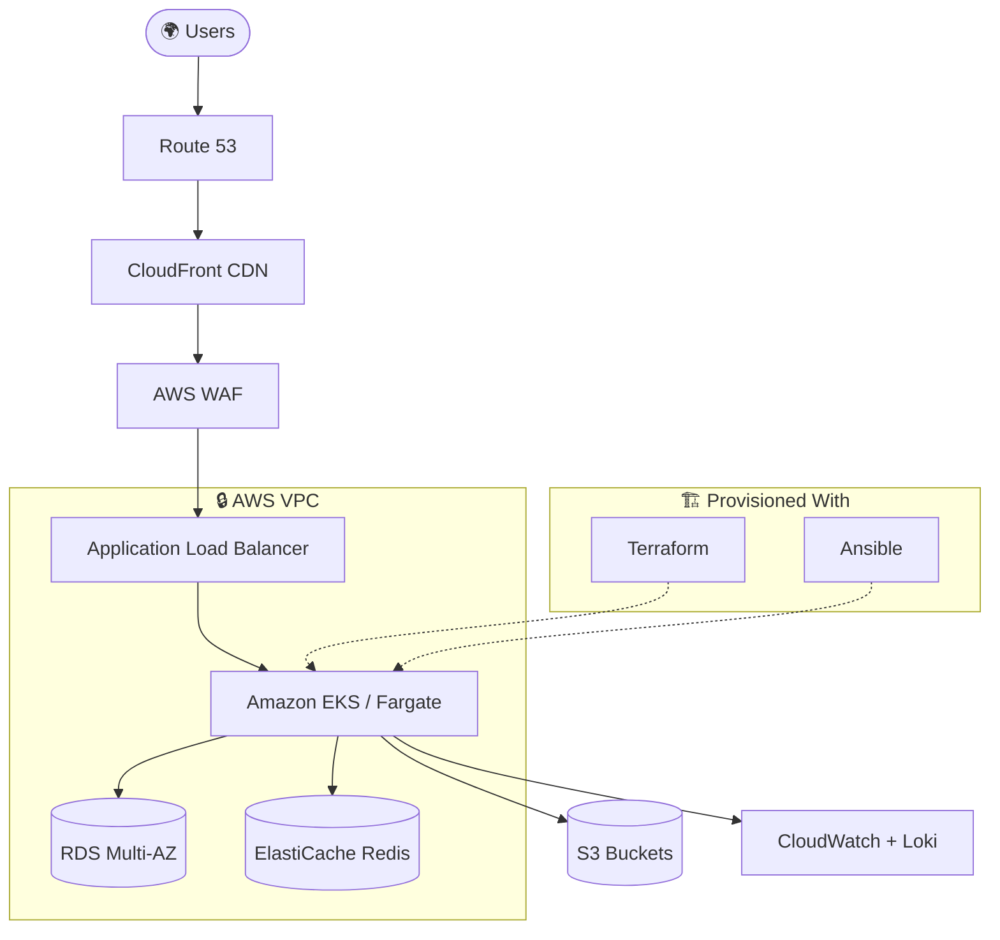
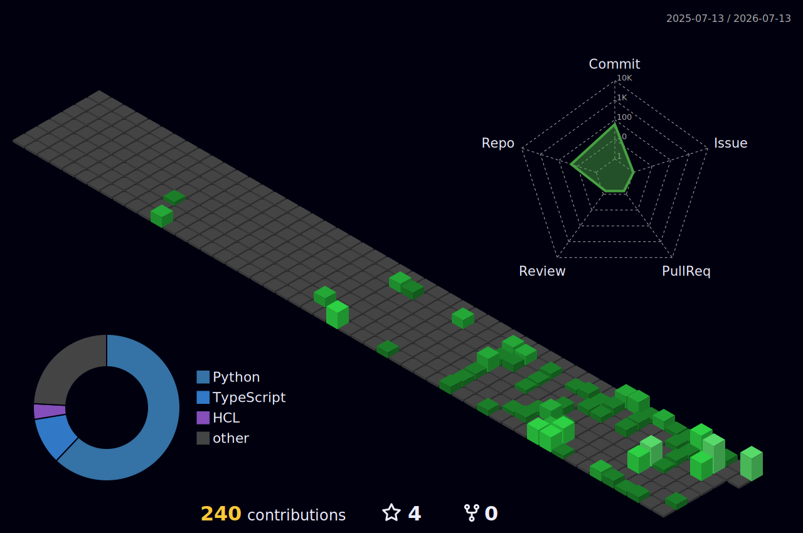

<h1 align="center">Hi there 👋, I'm Ammar Yasser</h1>

  

  

---

## 💫 About Me

- 🔭 &nbsp;**Junior DevOps Engineer @ [VPSie](https://vpsie.com)** — building and automating production infrastructure
- 📍 &nbsp;Based in **Cairo / Sohag, Egypt** 🇪🇬 · working fully remote
- 🌱 &nbsp;Currently going deep on **AWS, Kubernetes, Terraform, and observability**
- 🎯 &nbsp;Preparing for the **AWS Solutions Architect – Associate (SAA-C03)** certification
- 👯 &nbsp;Open to **DevOps collaborations** and learning-driven projects
- ⚡ &nbsp;Fun fact: I'm most productive in **quiet, focused environments**

---

## 🌐 Connect With Me

  
  
  

---

## 💬 Dev Quote of the Day

  

---

## 💻 Tech Stack

**☁️ Cloud & Platforms**

**📦 Containers & Orchestration**

**🏗️ Infrastructure as Code & Config**

**🔁 CI/CD & Version Control**

**📊 Monitoring & Observability**

**🖥️ Servers & Languages**

---

## 🚀 Featured Projects

### 🔍 OpsLens AI
> Multi-tenant **SaaS for AWS CloudWatch log analysis** with AI-generated incident reports. Securely connects to client AWS accounts using **IAM Role + STS AssumeRole** (no stored credentials).
>
> `FastAPI` · `Next.js` · `AWS` · `Vercel`
>
>  

### 📄 InfraDoc AI
> Automatically generates **IaC documentation and a security score** straight from a GitHub repo. Parses **Terraform, Kubernetes, Helm, and CloudFormation**.
>
> `FastAPI` · `Next.js` · `Vercel`
>
>  

### 🗺️ TopoForge
> Converts **low-level network designs (LLD) into high-level diagrams (HLD)** — turning a ~3-hour manual task into roughly **30 minutes**.
>
> `FastAPI` · `Next.js` · `Vercel`
>
>  

---

## 🔧 How I Ship — CI/CD Pipeline

---

## ☁️ Production AWS Architecture

---

## 📊 GitHub Stats

  

  

  

  

---

## 🎮 3D Contribution Graph

  

---

## 🏆 GitHub Trophies

  

---

## 🐍 Contribution Snake

  

<!--
  The snake above is generated by a GitHub Action (.github/workflows/snake.yml).
  It will appear blank until the workflow runs once. Run it manually from the
  Actions tab the first time, then it auto-updates daily.
-->

